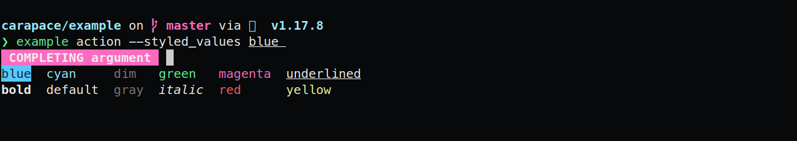

# ActionStyledValues

Same as [ActionValues](./actionValues.md) but accepts an additional [style](https://pkg.go.dev/github.com/rsteube/carapace/pkg/style).

```go
carapace.ActionStyledValues(
  "default", style.Default,
  "red", style.Red,
  "green-underlined", style.Of(style.Green, style.Underlined),
)
```


